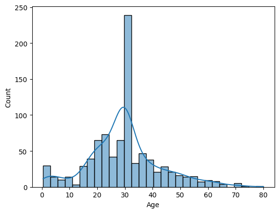
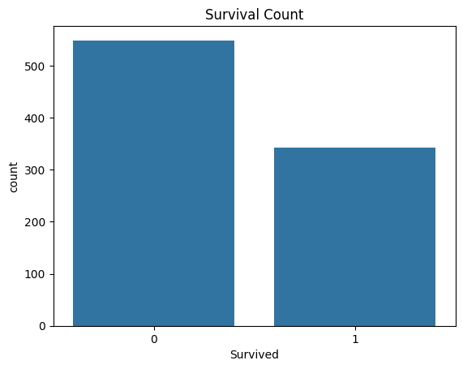
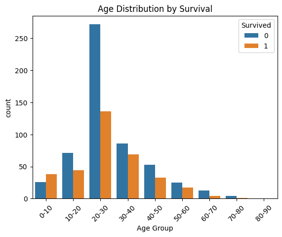
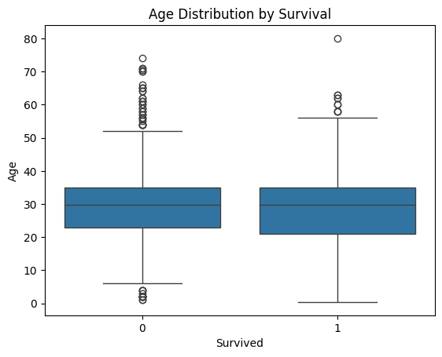
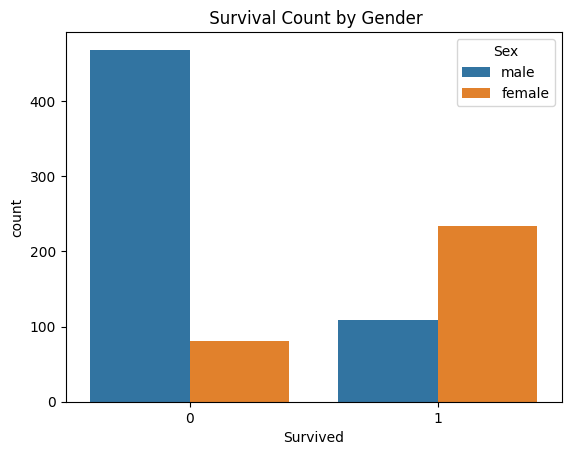
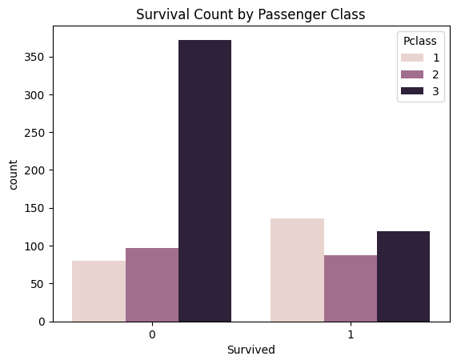
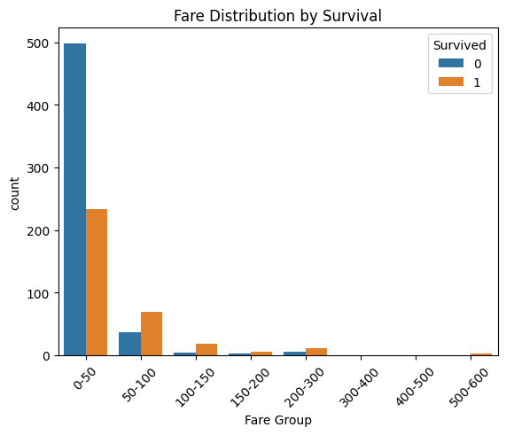
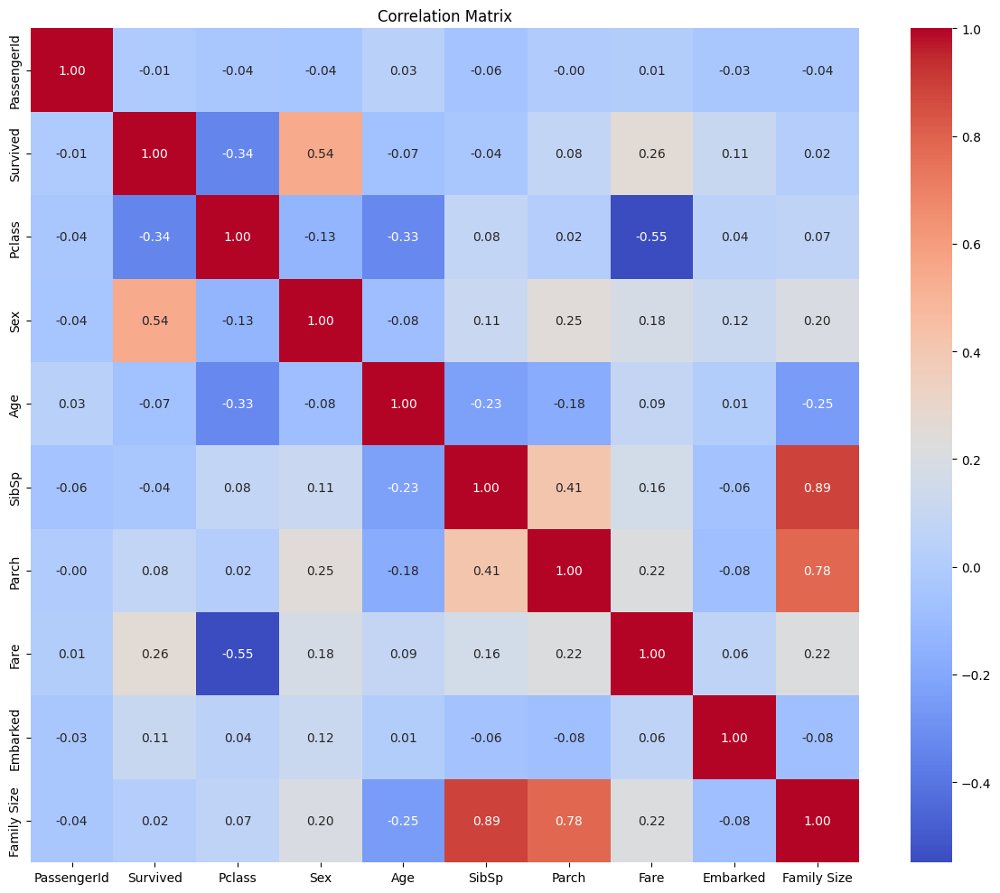

# 🚢 Titanic Dataset — Exploratory Data Analysis

A complete EDA on the Titanic dataset using Python (pandas, seaborn, matplotlib), including data cleaning, feature engineering, visualizations, and correlation analysis.

---

## 📁 Dataset

**Source:** [Kaggle Titanic Dataset](https://www.kaggle.com/c/titanic/data)  
**Records:** 891 passengers  
**Target Variable:** `Survived` (0 = No, 1 = Yes)

---

## 🛠️ Feature Engineering

The following new columns were created from existing data:

| Feature | Description |
|---|---|
| `Age Group` | Age binned into decade groups (0-10, 10-20, ..., 80-90) |
| `Fare Group` | Fare binned into price brackets (0-50, 50-100, ..., 500-600) |
| `Title` | Extracted from passenger name (Mr, Mrs, Miss, Master, etc.) |
| `Family Size` | `SibSp + Parch + 1` |

---

## 🧹 Data Cleaning

- `Age`: 177 missing values filled with **mean age**
- `Cabin`: Dropped due to ~77% missing values
- `Embarked`: 2 missing values (minimal impact)

---

## 📊 Visualizations & Insights

### 1. Age Distribution


The majority of passengers were between **20–40 years old**, with the highest concentration in the 20–30 bracket. The distribution is right-skewed, with fewer elderly passengers. The spike at ~30 is partly due to mean imputation for missing age values.

---

### 2. Survival Count


Only **~38% of passengers survived** (~342 out of 891). The dataset is slightly imbalanced — more passengers perished than survived.

---

### 3. Age Distribution by Survival


The 20–30 age group had the **highest absolute deaths**, but this is due to them being the largest group. Notably, children (0–10) had a **higher survival rate** relative to their group size — consistent with the "women and children first" evacuation protocol.

---

### 4. Age Distribution by Survival (Boxplot)


Both survived and non-survived groups have **similar median ages (~28–30)**, suggesting age alone is not a strong standalone predictor of survival. However, non-survivors show more outliers on the older end.

---

### 5. Survival Count by Gender


Gender is the **strongest predictor of survival**. Among survivors, females (~233) far outnumber males (~109). Among non-survivors, males (~468) dominate overwhelmingly. This confirms the "women and children first" evacuation priority.

---

### 6. Survival Count by Passenger Class


**1st class passengers had the highest survival rate**, while 3rd class had the most deaths by a large margin (~372 deaths). This reflects both physical proximity to lifeboats and socioeconomic priority during evacuation.

---

### 7. Fare Distribution by Survival


Most passengers paid fares in the **0–50 range**, and even here survivors are proportionally fewer. However, in the **50–100+ brackets**, the survival-to-death ratio improves significantly — higher fare passengers (1st class) had better survival odds.

---

### 8. Survival by Port of Embarkation


Southampton (S) had the most passengers and the most deaths. Cherbourg (C) passengers had a relatively **better survival ratio** — likely because more wealthy 1st class passengers boarded there. Queenstown (Q) had the fewest passengers overall.

---

### 9. Correlation Matrix


| Variable Pair | Correlation | Interpretation |
|---|---|---|
| Sex → Survived | +0.54 | Strongest predictor; females survived more |
| Pclass → Survived | -0.34 | Higher class number = lower survival |
| Fare → Survived | +0.26 | Higher fare = better survival odds |
| Age → Survived | -0.07 | Weak — age alone not decisive |
| SibSp ↔ Family Size | +0.89 | Expected — Family Size is derived from SibSp |
| Parch ↔ Family Size | +0.78 | Same reason |
| Pclass ↔ Fare | -0.55 | 1st class passengers paid significantly more |

---

## 🔑 Key Findings

1. **Gender** was the most decisive factor — females had dramatically higher survival rates.
2. **Passenger class** strongly influenced survival — 1st class passengers were prioritized.
3. **Fare** correlates with survival indirectly through passenger class.
4. **Age** alone had minimal impact, but children (0–10) showed relatively better survival.
5. **Port of embarkation** weakly correlates with survival, likely mediated by class.
6. **Family Size** is highly correlated with SibSp and Parch (as expected, being derived from them).

---

## 🧰 Tools Used

- Python 3.x
- pandas
- seaborn
- matplotlib
- numpy

---

## 📂 Project Structure

```
titanic-eda/
│
├── titanic.csv
├── titanic_eda.py
├── README.md
└── plots/
    ├── age_distribution.png
    ├── survival_count.png
    └── ...
```
